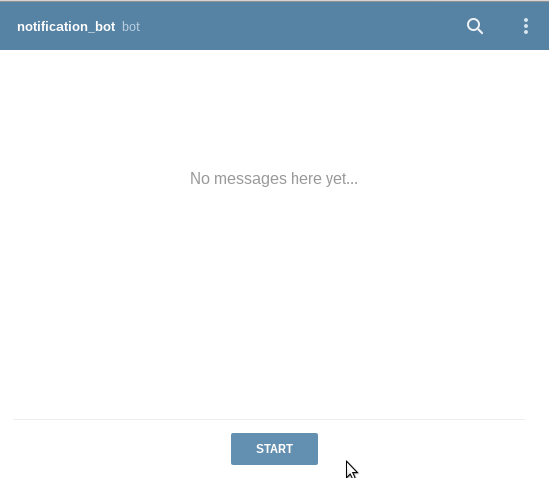

# Отправляем уведомления о проверке работ
Telegram чат-бот который отправляет уведомления о проверенных работах выполненных в рамках курса по python-программированию на сайте [Devman](https://dvmn.org/).

  
  
## Как установить
```
git clone https://github.com/Maxim80/devman_chatbot_work_review_notifications.git
cd devman_chatbot_work_review_notifications/
pip install -r requirements.txt
```
  
  
## Как запустить
Перед запуском необходимо создать файл `.env` и указать две переменные:  
`DEVMAN_TOKEN=<devman api токен>`  
`TELEGRAM_BOT_API_TOKEN=<telegram api токен>`  
  
  
Запустить микросервис:
```
python main.py <ваш telegram chat ID> --logger
```
Аргументы:  
`chat_id` - Обязательный агрумент, ваш telegram chat id.  
`--logger` - Не обязательный аргумент, включает debug.  
  
  
## Цели проекта
Проект написан в учебных целях в рамках курса по python-программированию на сайте [Devman](https://dvmn.org/).
